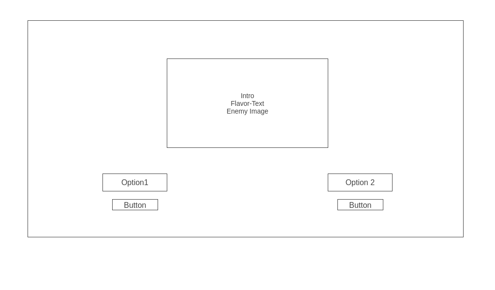

# The-Maze

## Overview ##

The maze is a simply Choose-Your-Adventure game that will ask the player to pick one of two choices that will determine what will happen next. The goal is to exit the maze. The player can choose minimal combat ability or hiding capability. Your choice will determine which encounters you can overcome. You’ll have to choose wisely to get out.

 ## WireFrame ##

## User Stoies ##

The player will be prompted with the maze welcome screen explaining how to proceed.  At the entrance of the maze, the user will have the following choices: A dagger or camouflage cloak. 

### Starting Items ###

` Dagger: 
    ` Capable of defeating smaller enemies

` Camouflage Cloak: 
    ` Capable of slipping past unbeatable enemies.

From here, the user will need to choose a starting path from 2 options. Each option will determine the next 2 encounters. 

The encounters include: 

- Small Enemies: Will normally include enemies that can be beaten with the dagger. (Slimes, wolves, etc.) and be bypassed with the cloak.

- Mobile enemies: Will only be passable with the dagger by defeating them. Players using the cloak will be spotted and the game will end.

- Large Stationary Enemies: Will only be passable with the cloak by sneaking through. Players using the dagger will not able to defeat the enemy and the game will end. 

- Depending on time left after creating the initial rooms, I will try to add rooms with with traps, chests, etc. 

Once all encounters are cleared the player will exit the maze and the game will end.

## User Interation ##

The game starts with the user being greeted by the narrator and will be asked to choose their item by clicking of of two buttons found on screen. Whichever item the player chooses will be set as their utility item.

The narrator will then confirm and display the players choice and prompt them with the options to go left or right. 

Once the player has chosen a direction, it will generate a new room with a random enemy inside. The game will check the players utility item and if that item is capable of beating or sneaking by the enemy, it will progress to the next room after the player chooses the left or right button again.

By the third room, the player will be prompted with confirmation buttons that will, a. provide encouragement text and allow them to continue, or b. allow the player to quick and start from the beginning. 

If the player is unable to defeat an enemy within any of the rooms, they will be brought to the game over screen as soon as a button is clicked again. If they are able to make it past the last room successfull, they will be prompted with a congradulations message and a restart button.

## Bugs/Missing Features ##

Bugs: 
- If the player is able to figure out enemy types, they can bypass the prerequisites. Solution found, but unable to implament in time. 

Missing Features: 
- Additional Room Types
- Option to help by pass the impassable enemy. (Currently set as an immediate game-over)

## Technologies ##

The following technologies were used to create the game: 

- Javascript
- HTML
- CSS
